# QRIVO — Entity-Relationship Diagram

> **Source:** Derived from `ORIGINAL_SPECIFICATION.md` and `docs/ATTENDANCE_ALGORITHM.md`.
> This diagram represents the complete approved database architecture.

---

## Complete ER Diagram

```mermaid
erDiagram

    %% ─── IDENTITY & ACCESS ────────────────────────────────────────────────────

    users {
        bigint id PK
        char uuid UK
        varchar email UK
        varchar password_hash
        varchar first_name
        varchar last_name
        tinyint is_active
        tinyint is_approved
        datetime created_at
        datetime updated_at
        datetime deleted_at
    }

    roles {
        int id PK
        varchar name UK
        varchar display_name
        datetime created_at
        datetime updated_at
    }

    permissions {
        int id PK
        varchar name UK
        varchar display_name
        datetime created_at
        datetime updated_at
    }

    role_permissions {
        int role_id PK
        int permission_id PK
    }

    user_roles {
        bigint user_id PK
        int role_id PK
        datetime created_at
    }

    login_attempts {
        bigint id PK
        bigint user_id FK
        varchar email_attempted
        varchar ip_address
        varchar user_agent
        tinyint success
        datetime created_at
    }

    device_sessions {
        bigint id PK
        char uuid UK
        bigint user_id FK
        varchar device_fingerprint
        varchar device_name
        varchar ip_address
        text user_agent
        varchar access_token_hash
        varchar refresh_token_hash
        datetime expires_at
        datetime last_active_at
        datetime revoked_at
        datetime created_at
        datetime updated_at
    }

    %% ─── ACADEMIC STRUCTURE ───────────────────────────────────────────────────

    schools {
        int id PK
        varchar name
        varchar code UK
        datetime created_at
        datetime updated_at
        datetime deleted_at
    }

    faculties {
        int id PK
        int school_id FK
        varchar name
        varchar code
        datetime created_at
        datetime updated_at
        datetime deleted_at
    }

    departments {
        int id PK
        int faculty_id FK
        varchar name
        varchar code
        datetime created_at
        datetime updated_at
        datetime deleted_at
    }

    programs {
        int id PK
        int department_id FK
        varchar name
        varchar code
        tinyint duration_years
        datetime created_at
        datetime updated_at
        datetime deleted_at
    }

    academic_years {
        int id PK
        int school_id FK
        varchar name
        date start_date
        date end_date
        tinyint is_active
        datetime created_at
        datetime updated_at
    }

    academic_terms {
        int id PK
        int academic_year_id FK
        varchar name
        tinyint term_number
        date start_date
        date end_date
        tinyint is_active
        datetime created_at
        datetime updated_at
    }

    classes {
        int id PK
        int program_id FK
        int academic_term_id FK
        varchar name
        tinyint grade_level
        datetime created_at
        datetime updated_at
        datetime deleted_at
    }

    rooms {
        int id PK
        int school_id FK
        varchar name
        varchar code
        smallint capacity
        datetime created_at
        datetime updated_at
        datetime deleted_at
    }

    courses {
        int id PK
        int department_id FK
        varchar name
        varchar code
        tinyint credit_hours
        datetime created_at
        datetime updated_at
        datetime deleted_at
    }

    %% ─── PEOPLE PROFILES ──────────────────────────────────────────────────────

    teachers {
        int id PK
        bigint user_id UK
        int department_id FK
        varchar employee_number UK
        datetime created_at
        datetime updated_at
        datetime deleted_at
    }

    students {
        bigint id PK
        bigint user_id UK
        int program_id FK
        varchar student_number UK
        year enrollment_year
        datetime created_at
        datetime updated_at
        datetime deleted_at
    }

    %% ─── ASSIGNMENTS & SCHEDULE ───────────────────────────────────────────────

    class_courses {
        int id PK
        int class_id FK
        int course_id FK
        int academic_term_id FK
    }

    teacher_courses {
        int id PK
        int teacher_id FK
        int course_id FK
        int academic_term_id FK
    }

    teacher_class_assignments {
        int id PK
        int teacher_id FK
        int class_id FK
        int course_id FK
        int academic_term_id FK
    }

    student_class_assignments {
        bigint id PK
        bigint student_id FK
        int class_id FK
        int academic_term_id FK
        datetime enrolled_at
    }

    student_courses {
        bigint id PK
        bigint student_id FK
        int course_id FK
        int class_id FK
        int academic_term_id FK
    }

    course_schedules {
        int id PK
        int teacher_class_assignment_id FK
        int room_id FK
        tinyint day_of_week
        time start_time
        time end_time
        datetime created_at
        datetime updated_at
    }

    %% ─── ATTENDANCE (CORE) ────────────────────────────────────────────────────

    attendance_sessions {
        bigint id PK
        char uuid UK
        int course_id FK
        int class_id FK
        int teacher_id FK
        int room_id FK
        int academic_term_id FK
        datetime start_time
        datetime end_time
        datetime expires_at
        varchar status
        varchar session_secret
        datetime created_at
        datetime updated_at
    }

    attendance_records {
        bigint id PK
        bigint attendance_session_id FK
        bigint student_id FK
        varchar status
        varchar source
        datetime marked_at
        datetime created_at
        datetime updated_at
    }

    %% ─── QR & CHALLENGE ───────────────────────────────────────────────────────

    qr_challenges {
        bigint id PK
        char uuid UK
        bigint attendance_session_id FK
        bigint student_id FK
        varchar nonce UK
        varchar qr_nonce
        datetime expires_at
        datetime used_at
        datetime created_at
    }

    %% ─── SECURITY & RISK ──────────────────────────────────────────────────────

    risk_assessments {
        bigint id PK
        bigint qr_challenge_id FK
        bigint student_id FK
        bigint attendance_session_id FK
        varchar risk_level
        smallint risk_score
        json signals
        varchar outcome
        datetime created_at
    }

    security_events {
        bigint id PK
        varchar event_type
        varchar severity
        bigint user_id FK
        bigint attendance_session_id FK
        varchar ip_address
        text user_agent
        json details
        datetime created_at
    }

    audit_logs {
        bigint id PK
        varchar event_type
        bigint actor_user_id FK
        varchar target_entity
        bigint target_id
        json old_value
        json new_value
        text reason
        varchar ip_address
        datetime created_at
    }

    system_settings {
        int id PK
        varchar key UK
        text value
        varchar type
        text description
        datetime created_at
        datetime updated_at
    }

    %% ─── RELATIONSHIPS ────────────────────────────────────────────────────────

    users ||--o{ user_roles : "has"
    roles ||--o{ user_roles : "assigned via"
    roles ||--o{ role_permissions : "has"
    permissions ||--o{ role_permissions : "granted via"
    users ||--o{ login_attempts : "tracked in"
    users ||--o{ device_sessions : "authenticated via"

    users ||--o| teachers : "profile"
    users ||--o| students : "profile"

    schools ||--o{ faculties : "contains"
    schools ||--o{ academic_years : "has"
    schools ||--o{ rooms : "has"

    faculties ||--o{ departments : "contains"
    departments ||--o{ programs : "offers"
    departments ||--o{ courses : "owns"
    departments ||--o{ teachers : "employs"

    programs ||--o{ students : "enrolls"
    programs ||--o{ classes : "has"

    academic_years ||--o{ academic_terms : "has"
    academic_terms ||--o{ classes : "active in"
    academic_terms ||--o{ class_courses : "scoped to"
    academic_terms ||--o{ teacher_courses : "scoped to"
    academic_terms ||--o{ teacher_class_assignments : "scoped to"
    academic_terms ||--o{ student_class_assignments : "scoped to"
    academic_terms ||--o{ student_courses : "scoped to"
    academic_terms ||--o{ attendance_sessions : "scoped to"

    classes ||--o{ class_courses : "has"
    classes ||--o{ teacher_class_assignments : "assigned"
    classes ||--o{ student_class_assignments : "has"
    classes ||--o{ student_courses : "linked via"
    classes ||--o{ attendance_sessions : "has"

    courses ||--o{ class_courses : "offered as"
    courses ||--o{ teacher_courses : "taught by"
    courses ||--o{ teacher_class_assignments : "for"
    courses ||--o{ student_courses : "taken by"
    courses ||--o{ attendance_sessions : "for"

    teachers ||--o{ teacher_courses : "teaches"
    teachers ||--o{ teacher_class_assignments : "assigned to"
    teachers ||--o{ attendance_sessions : "starts"

    students ||--o{ student_class_assignments : "enrolled in"
    students ||--o{ student_courses : "takes"
    students ||--o{ attendance_records : "has"
    students ||--o{ qr_challenges : "owns"
    students ||--o{ risk_assessments : "assessed in"

    teacher_class_assignments ||--o{ course_schedules : "scheduled as"
    rooms ||--o{ course_schedules : "used in"
    rooms ||--o{ attendance_sessions : "used in"

    attendance_sessions ||--o{ attendance_records : "contains"
    attendance_sessions ||--o{ qr_challenges : "generates"
    attendance_sessions ||--o{ risk_assessments : "evaluated in"
    attendance_sessions ||--o{ security_events : "linked to"

    qr_challenges ||--o{ risk_assessments : "triggers"

    users ||--o{ security_events : "involved in"
    users ||--o{ audit_logs : "acted by"
```

---

## Key Integrity Points

| Constraint | Table | Purpose |
|------------|-------|---------|
| `UNIQUE(attendance_session_id, student_id)` | `attendance_records` | Prevent duplicate attendance — core algorithm requirement |
| `UNIQUE(nonce)` | `qr_challenges` | Ensure each challenge nonce is globally unique |
| `UNIQUE(uuid)` on sessions/challenges | Multiple | Safe external references without exposing internal IDs |
| `session_secret` on `attendance_sessions` | `attendance_sessions` | Per-session HMAC key for QR signing |
| `used_at` nullable | `qr_challenges` | NULL = unused; non-NULL = consumed (single-use enforcement) |
